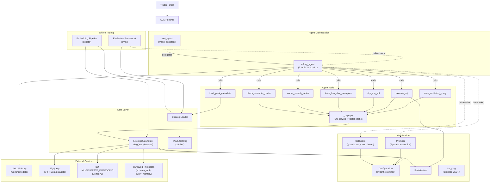

# Architecture Assessment Report

**Generated:** 2026-02-20
**Repository:** nl2sql-agent
**Assessment method:** Automated multi-agent architecture review (autopsy plugin)

---

## Executive Summary

This NL2SQL agent converts natural language questions from Mako Group's options trading desk into BigQuery SQL queries through a 7-tool pipeline: semantic cache check, vector search for table routing, YAML metadata loading, few-shot retrieval, SQL dry-run validation, execution, and a learning loop that stores validated queries for future retrieval. The component architecture is well-designed with clean protocol-based dependency injection, structured logging, and a comprehensive 155+ unit test suite. However, the review uncovered three systemic issues that undermine the system's ability to achieve its core goal: (1) the learning loop's embedding generation has a NULL-vs-empty-array mismatch that prevents newly saved queries from ever becoming searchable, breaking the self-improvement mechanism; (2) the few-shot examples -- the primary learning signal for SQL generation -- contain numerous incorrect column names across 4 of 5 KPI tables and both complex data-layer examples, poisoning the LLM's SQL output; and (3) the read-only SQL guard uses a first-keyword heuristic that can be bypassed by `WITH ... INSERT` patterns, which is concerning for a system executing LLM-generated SQL against production trading data. The top recommendation is to fix the metadata quality issues (examples, catalog consistency, learning loop) before addressing the security hardening, as the agent's accuracy depends directly on these.

---

## 1. System Purpose & Goals

**Purpose:** Convert natural language questions from options traders into BigQuery SQL queries, execute them, and return formatted results -- enabling non-technical trading desk personnel to access KPI metrics, raw execution data, theoretical pricing, and market depth data without writing SQL.

**Serves:** Mako Group's options trading desk (internal users). Traders need fast, accurate answers to questions about trade execution quality, PnL, slippage, and market conditions.

**Key Value:** Eliminates the latency of ad-hoc analyst requests for data access. Without this system, traders depend on SQL-skilled analysts or pre-built dashboards that may not cover their specific questions, introducing delay into time-sensitive trading decisions.

**Operating Context:** Interactive/real-time via ADK web UI or terminal. Internal-only. Single-user or small-team concurrent usage. Currently in active development (4 of 5 tracks complete). BigQuery as the sole data warehouse with ~12 tables across 2 datasets (KPI aggregates and raw data).

---

## 2. Component Architecture

### Component Map

### Component Summary

| Component | Purpose | Responsibility Clarity | Health |
|-----------|---------|----------------------|--------|
| Agent Orchestration | Two-agent hierarchy (root delegates to nl2sql), LLM wiring | Clear | Concerns -- module-level BQ client init side effects |
| Configuration | Centralized env-based config via pydantic-settings | Clear | Healthy |
| Protocol Layer | DI contracts (BigQueryProtocol, EmbeddingProtocol) | Clear | Healthy |
| BigQuery Client | Production BQ interactions (query, dry-run, schema) | Clear | Concerns -- no timeout on execute_query, inconsistent error handling |
| Agent Tools (7) | Core pipeline: cache, search, metadata, validate, execute, learn | Clear | Concerns -- learning loop broken, examples have wrong column names |
| Callbacks | DML guard, retry tracking, loop detection | Mixed | Concerns -- state not reset across questions, DML guard bypassable |
| Prompt Engineering | Dynamic system instruction with session context | Clear | Healthy |
| YAML Metadata Catalog | Static table/column metadata, routing rules | Clear | Concerns -- duplicate descriptions, missing brokertrade.yaml, inconsistencies |
| Catalog Loader | YAML parsing with LRU cache and validation | Clear | Concerns -- returns None for empty files, cache mutation |
| Embedding Pipeline | Offline BQ metadata + vector index creation | Mixed | Critical -- NULL embedding bug, destructive CREATE OR REPLACE, non-idempotent routing |
| Evaluation Framework | Gold query validation, offline + online eval | Mixed | Critical -- online mode non-functional (wrong ADK API usage) |
| Logging | Structured JSON logging via structlog | Clear | Healthy |

### Component Interactions

**Well-designed interactions:**
- Agent Orchestration to Callbacks: loose coupling via ADK callback protocol
- Agent Orchestration to Prompt Engineering: clean function-reference injection via ReadonlyContext
- Agent Tools to BigQuery Client: protocol-based DI enables testability
- Combined CTE vector search: single embedding for two table searches reduces latency

**Problematic interactions:**
- Agent Orchestration module-level initialization: importing `nl2sql_agent` triggers real BQ client creation, blocking CI and test environments without GCP credentials
- Metadata Loader to YAML Catalog: hardcoded `_TABLE_YAML_MAP` and `_DATASET_TABLE_MAP` require manual coordination for new tables (4 places need updating)
- Metadata Loader mutating LRU-cached dict: `content["_kpi_dataset_context"]` modifies the cached object, causing cache corruption across callers
- Evaluation Framework monkey-patching tools list: online eval replaces tools by list index, which breaks with ADK FunctionTool wrappers

### Architectural Strengths

1. **Protocol-based dependency injection** (`protocols.py` + `clients.py` + `fakes.py`) enables both strict (`FakeBigQueryClient` raises on unregistered queries) and flexible (`MockBigQueryService`) testing strategies. This is textbook clean architecture applied pragmatically.

2. **Combined CTE vector search** generates one embedding and searches two tables (`schema_embeddings` + `query_memory`) in a single BigQuery round-trip. The fallback to schema-only search on failure adds resilience.

3. **Dynamic prompt with session state** injects follow-up context and retry status, enabling conversational coherence (reusing previous table context) and intelligent retry behavior (LLM knows attempts remaining).

4. **Semantic cache with learning loop** creates a virtuous cycle where validated query-SQL pairs improve future performance. The parameterized INSERT for user-supplied values in the learning loop follows security best practices.

5. **Structured logging throughout** every tool call, BQ query, cache hit/miss, and state transition is logged with structured JSON including relevant context (SQL previews, row counts, distances).

6. **Comprehensive test infrastructure** with 155+ unit tests, separated integration tests, module-level env var handling for the Settings singleton, and graceful skip behavior when live services are unavailable.

7. **YAML catalog with validation** ensures structural correctness and the `{project}` placeholder pattern keeps files environment-agnostic.

### Architectural Concerns

- **Broken learning loop:** The `ARRAY_LENGTH(NULL) = 0` predicate in both `learning_loop.py` and `run_embeddings.py` means newly saved queries never get embeddings generated, making the entire self-improvement mechanism non-functional.
- **Poisoned few-shot examples:** Incorrect column names (`edge` instead of `instant_edge`, `bid_size_0` instead of `bid_volume_0`, `putcall` instead of `option_type_name`) across 15+ example queries teach the LLM wrong SQL patterns.
- **Contradictory routing rules:** The `kpi/_dataset.yaml` trade taxonomy warns against summing markettrade with the 4 Mako-specific tables, but the routing section and example query do exactly that -- risking double-counted PnL reports.
- **Module-level initialization side effects:** Any import of `nl2sql_agent` triggers BigQuery client creation, coupling the entire package to GCP credential availability.

---

## 3. Tooling Assessment

### Stack Overview

| Tool | Version | Used For | Fit Assessment |
|------|---------|----------|---------------|
| Google ADK | >=1.0.0 (latest 1.25.1) | Agent framework, tool registration, callbacks | Good Fit |
| LiteLLM | >=1.40.0 | LLM abstraction via local proxy | Good Fit |
| BigQuery | >=3.25.0 | Data warehouse + vector search + embeddings | Good Fit |
| Vertex AI text-embedding-005 | Current | Embedding generation via BQ ML | Good Fit |
| pydantic-settings | >=2.0.0 | Configuration management | Good Fit |
| structlog | >=24.0.0 | Structured JSON logging | Good Fit |
| pytest + pytest-asyncio | >=8.0.0 / >=0.23.0 | Testing framework | Good Fit |
| Docker | python:3.11-slim | Containerized deployment | Acceptable -- needs fixes |
| YAML | N/A | Metadata catalog format | Good Fit |

### Detailed Analysis

**Google ADK:** The codebase correctly follows ADK's FunctionTool return-value conventions (status key in dicts) and uses a callable for dynamic instruction generation. However, it diverges from ADK best practices in two areas: (1) the callback `before_tool_guard` combines DML blocking, circuit breaking, repetition detection, and safety caps into a single function, whereas ADK docs recommend single-purpose callbacks ([source](https://google.github.io/adk-docs/callbacks/design-patterns-and-best-practices/)); (2) session state keys use unprefixed names like `tool_call_count` instead of ADK's `temp:` prefix convention for per-invocation data ([source](https://google.github.io/adk-docs/sessions/state/)). The custom evaluation framework does not leverage ADK's built-in `adk eval` with `*.test.json` files ([source](https://google.github.io/adk-docs/evaluate/)), though an initial `routing_eval.test.json` exists in `eval/adk/`.

**BigQuery:** The codebase correctly uses parameterized queries (`@param`) for user-supplied values and `.format()` for structural identifiers (table names, model names) that cannot be parameterized -- matching BigQuery's documented limitations ([source](https://cloud.google.com/bigquery/docs/parameterized-queries)). Vector indexes with stored columns would improve VECTOR_SEARCH performance ([source](https://cloud.google.com/bigquery/docs/vector-index)), and BigQuery's autonomous embedding generation could replace the manual learning loop embedding step ([source](https://cloud.google.com/bigquery/docs/autonomous-embedding-generation)). The ADK NL2SQL sample uses `BigQueryToolset` with `WriteMode.BLOCKED` for server-side read-only enforcement ([source](https://github.com/google/adk-samples/blob/main/python/agents/data-science/)), which is more robust than the codebase's first-keyword check.

**Docker:** The Dockerfile has three issues: (1) `pip install -e .` on line 12 runs before source code is copied, breaking the editable install; (2) no `.dockerignore` exists, so `COPY . .` copies `.env` files with secrets into image layers; (3) the container runs as root with no `USER` directive. Docker best practices recommend non-root users, `.dockerignore`, and multi-stage builds ([source](https://docs.docker.com/build/building/best-practices/)).

### Deprecated Patterns Found

| Pattern | Location | Recommended Replacement | Migration Guide |
|---------|----------|------------------------|----------------|
| First-keyword SQL guard | `callbacks.py:54`, `sql_executor.py:34` | ADK `BigQueryToolset` with `WriteMode.BLOCKED` or `sqlglot` AST parsing | [ADK Safety](https://google.github.io/adk-docs/safety/) |
| `CREATE OR REPLACE TABLE` | `run_embeddings.py:64,76,89` | `CREATE TABLE IF NOT EXISTS` + autonomous embedding generation | [BQ Autonomous Embeddings](https://cloud.google.com/bigquery/docs/autonomous-embedding-generation) |
| Manual embedding INSERT+UPDATE | `learning_loop.py:74-97` | Autonomous embedding generation on `query_memory` table | [BQ Autonomous Embeddings](https://cloud.google.com/bigquery/docs/autonomous-embedding-generation) |
| Unpinned base image `python:3.11-slim` | `Dockerfile:1` | Pinned digest `python:3.11.11-slim@sha256:<digest>` | [Docker Best Practices](https://docs.docker.com/build/building/best-practices/) |
| Open-ended dependency pins `>=` | `pyproject.toml:6-18` | Bounded ranges + lock file via `pip-compile` | [pip-tools](https://github.com/jazzband/pip-tools) |

---

## 4. Quality Attribute Analysis

### Quality Attribute Matrix

| Quality Attribute | Evidence of Priority | Current Support Level |
|---|---|---|
| Performance | Combined CTE vector search (single embedding, two searches), LRU cache on YAML loading, per-question vector cache avoids redundant embedding calls | Moderate -- optimizations exist but BigQuery-as-vector-DB introduces ~100-300ms latency per embedding call. KPI YAML files (5000-8000 lines each) consume 40,000-60,000 tokens per metadata load. No query result caching. |
| Scalability | Single-process, single-user design. Module-level globals in `_deps.py`. No horizontal scaling patterns. | Weak -- designed for single-user interactive use. Module globals hold state without locking. Appropriate for current use but would not scale to multi-user without refactoring. |
| Reliability | Graceful fallback in vector search (combined -> schema-only). Partial success handling in learning loop. Semantic cache degrades to cache_miss on error. | Moderate -- individual tools handle errors gracefully. No circuit breakers for BQ or LiteLLM. No retry with backoff for transient failures. Circuit breaker state (`max_retries_reached`) not reset across questions, causing session-ending bugs. |
| Security | DML guard in callbacks + sql_executor. Parameterized queries for user input. Row limit enforcement (max 1000). | Weak -- DML guard is a first-keyword check bypassable via `WITH ... INSERT`. Learning loop executes DML bypassing the guard. Production API key committed in git history. `execute_query()` has no table allowlisting. Code review found the guard bypassed in 3 different ways across callbacks.py and sql_executor.py. |
| Maintainability | Clean component boundaries, protocol-based DI, consistent tool return patterns, structured logging, track-based development. | Strong -- the codebase demonstrates intentional design. However, adding a new table requires coordinated changes in 4 places (YAML file, `_TABLE_YAML_MAP`, `_DATASET_TABLE_MAP`, prompt routing rules), and routing intelligence is distributed across 4 files. |
| Testability | BigQueryProtocol enables mock injection. FakeBigQueryClient and MockBigQueryService for testing. 155+ unit tests. Integration tests separated by marker. | Strong -- protocol-based DI is the foundation. Test isolation is well-handled. However, mock infrastructure never simulates errors (MockBigQueryService always succeeds), leaving error paths under-tested. Several integration tests use mocks and belong in unit tests. |
| Operability | structlog JSON logging. Docker deployment with ADC passthrough. Shell scripts with prerequisite checks. Eval framework for regression. | Moderate -- good logging and local dev tooling. No health checks, no monitoring/alerting, no deployment automation beyond Docker. Docker image has security gaps (runs as root, no `.dockerignore`, secrets in layers). |
| Extensibility | Routing rules in YAML (editable without code changes). New tables addable via YAML + embedding pipeline. Learning loop provides organic improvement. | Moderate -- table addition requires 4 coordinated changes. Routing descriptions duplicated between `_routing.yaml`, `_dataset.yaml`, `prompts.py`, and `run_embeddings.py`. No plugin system but appropriate for scope. |

### Key Tradeoffs

1. **BigQuery as data warehouse + vector search + embedding engine:** Simplifies operations (one platform, no data sync) at the cost of higher per-query latency (BQ job overhead). For the current scale (~20 schema rows, ~50 query memory rows), the consolidation benefit outweighs the latency cost. This would need revisiting if sub-second response times become critical or metadata volume exceeds 5,000 rows (the threshold for TREE_AH index activation).

2. **Module-level singleton initialization:** Simplifies usage (one-line import) at the cost of testability (env vars must be set before import) and deployment flexibility (cannot have multiple configurations). Appropriate for a single-process agent but blocks CI environments and prevents multi-tenant patterns.

3. **Detailed system prompt with hardcoded routing rules:** Provides reliable, auditable routing at the cost of maintainability (adding a table requires updating both YAML and prompt). The prompt provides a safety net for ambiguous vector search results.

4. **Learning loop writing directly to query_memory:** Enables organic improvement at the cost of data quality (no review process for LLM-validated queries). Currently moot because the embedding generation is broken.

### Sensitivity Points

1. **Semantic cache threshold (0.10 cosine distance):** Directly controls the tradeoff between response latency (cache hit) and answer freshness (full pipeline). Too low = never cached; too high = stale SQL served for dissimilar questions.

2. **DML guard implementation:** The single check at callbacks.py:54 and sql_executor.py:34 is the primary security boundary for a system executing LLM-generated SQL against production trading data.

3. **Module-level agent initialization (agent.py:35-38):** Makes the system sensitive to GCP credential availability at import time, affecting testability, CI, and deployment flexibility.

4. **Vector search top_k (5):** Affects routing accuracy. Too few results miss correct tables; too many dilute LLM context with irrelevant options.

5. **Few-shot example quality:** The examples in `query_memory` are the primary signal for SQL column usage patterns. Incorrect column names in examples directly cause incorrect generated SQL.

---

## 5. Design Gaps & Recommendations

### CRITICAL: Learning loop embedding generation is broken due to NULL predicate mismatch

**Problem:** Newly inserted rows in `query_memory` have NULL embeddings, but the UPDATE's WHERE clause `ARRAY_LENGTH(t.embedding) = 0` never matches NULL values in BigQuery. The same bug exists in the offline embedding pipeline (`run_embeddings.py`), meaning neither runtime nor batch embedding generation works.

**Evidence:**
- Architecture analysis: Identified the learning loop as a write path that creates a two-step INSERT+UPDATE pattern, noting "partial success is handled gracefully"
- Research: BigQuery documentation confirms `ARRAY_LENGTH(NULL)` returns NULL, not 0 ([source](https://cloud.google.com/bigquery/docs/reference/standard-sql/array_functions#array_length))
- Code findings: Bug-hunter found the same NULL mismatch in `learning_loop.py:31`, `run_embeddings.py:243,256,269`. Error-inspector confirmed the UPDATE affects 0 rows and returns "success" status despite being a no-op. The embedding pipeline's `generate_embeddings` step is entirely non-functional.

**Recommended approach:** Fix the NULL predicate across both runtime and batch code paths. Evaluate BigQuery autonomous embedding generation for the `query_memory` table to eliminate the manual two-step pattern entirely.

**Implementation sketch:**
1. Change all `WHERE ARRAY_LENGTH(t.embedding) = 0` to `WHERE t.embedding IS NULL OR ARRAY_LENGTH(t.embedding) = 0` in `learning_loop.py` and `run_embeddings.py`
2. Scope the learning loop UPDATE to only the newly inserted row (add `AND t.question = @question`)
3. Evaluate autonomous embedding generation for `query_memory` to remove the manual embed step

**Impact:** Restores the self-improvement mechanism. Without this fix, every validated query saved via the learning loop is invisible to vector search, and the offline embedding pipeline produces empty indexes.
**Effort:** S
**Risk of not doing this:** The learning loop is completely non-functional. The agent cannot learn from validated queries. The offline embedding pipeline produces empty vector indexes, making semantic routing non-functional after any table recreation.

---

### CRITICAL: Few-shot examples contain incorrect column names, poisoning SQL generation

**Problem:** 15+ example queries reference columns that do not exist on their target tables (`edge` instead of `instant_edge` on 4 of 5 KPI tables, `bid_size_0` instead of `bid_volume_0`, `putcall` instead of `option_type_name` on marketdepth, wrong column name ordering for slippage intervals). These examples are loaded into `query_memory` and served as few-shot templates.

**Evidence:**
- Architecture analysis: Identified the semantic cache + learning loop as "a virtuous cycle where the agent gets better over time" -- but the seed data is incorrect
- Research: NL2SQL best practices emphasize that few-shot retrieval from validated examples is the primary accuracy driver ([source](https://discuss.google.dev/t/nlp2sql-using-dynamic-rag-based-few-shot-examples/166479))
- Code findings: Bug-hunter batch 4 identified `edge` used on quotertrade/brokertrade/clicktrade/otoswing (lines 121,137,173,188,205,224 of `kpi_examples.yaml`), `bid_size_0`/`ask_size_0`/`putcall` on marketdepth (lines 315-346 of `data_examples.yaml`), wrong slippage column names (lines 329,426 of `kpi_examples.yaml`)

**Recommended approach:** Audit all example SQL against the YAML catalog column definitions. Add a validation step that cross-references example SQL column names against catalog schemas.

**Implementation sketch:**
1. Replace `edge` with `instant_edge` in all KPI examples (all tables)
2. Replace `bid_size_0`/`ask_size_0` with `bid_volume_0`/`ask_volume_0` and `putcall` with `option_type_name` in marketdepth examples
3. Fix slippage column name ordering (`vol_slippage_10m_per_unit`, `delta_slippage_1h_fired_at`)
4. Add a test that extracts column names from example SQL and validates them against the table YAML column lists
5. Replace all `SELECT *` examples with explicit column lists (8 examples affected)

**Impact:** Directly improves SQL generation accuracy for edge-related queries (the most common KPI metric) and market depth queries (complex cross-table patterns). Eliminates dry-run failures caused by nonexistent column references.
**Effort:** S
**Risk of not doing this:** The LLM generates SQL with wrong column names for 4 of 5 KPI tables and both complex marketdepth examples, causing persistent dry-run failures and retry loops.

---

### CRITICAL: Contradictory routing rules risk double-counted PnL in trading reports

**Problem:** The `kpi/_dataset.yaml` trade taxonomy warns "you MUST NOT sum markettrade + the others because that double-counts Mako's trades," but the routing section in the same file says "all trades/total PnL -> UNION ALL across all 5 kpi tables," and an example query does exactly this.

**Evidence:**
- Architecture analysis: Noted the prompt has "hardcoded table lists and routing rules" with maintenance concerns
- Research: NL2SQL reference architectures emphasize that incorrect routing produces materially wrong answers ([source](https://aws.amazon.com/blogs/machine-learning/enterprise-grade-natural-language-to-sql-generation-using-llms-balancing-accuracy-latency-and-scale/))
- Code findings: Bug-hunter batch 4 confirmed the contradiction between `kpi/_dataset.yaml:18-25` (trade taxonomy) and `kpi/_dataset.yaml:185-187` (routing rule) and `kpi_examples.yaml:237-264` (example query)

**Recommended approach:** Resolve the contradiction by aligning routing rules with the trade taxonomy. Separate "all market trades" (markettrade alone) from "Mako-only total" (UNION of 4 Mako-specific tables).

**Implementation sketch:**
1. Update `kpi/_dataset.yaml` routing to split "all trades" into two patterns: markettrade-only for all-participant queries, 4-table UNION for Mako-only queries
2. Fix the example query to demonstrate the correct pattern
3. Add an explicit routing_signal warning about the double-counting trap
4. Update `prompts.py` routing rules to match

**Impact:** Prevents materially incorrect PnL reports to traders. Incorrect PnL reporting on a trading desk is an operational risk.
**Effort:** S
**Risk of not doing this:** Traders receive double-counted PnL figures and may make trading decisions based on inflated numbers.

---

### HIGH: Read-only SQL guard relies on first-keyword heuristic, bypassable via WITH...INSERT

**Problem:** The DML guard in both `callbacks.py` and `sql_executor.py` checks only the first word of SQL against an allowlist (`SELECT`, `WITH`, ``). A `WITH cte AS (SELECT 1) INSERT INTO ...` statement passes because `WITH` is allowed. BigQuery supports this syntax.

**Evidence:**
- Architecture analysis: Identified this as a security sensitivity point, noting "the guard is the only protection for other tools" since the BQ client has write permissions
- Research: ADK's official NL2SQL sample uses `BigQueryToolset` with `WriteMode.BLOCKED` for server-side enforcement ([source](https://github.com/google/adk-samples)); the first-keyword approach is listed as a known anti-pattern ([source](https://google.github.io/adk-docs/safety/))
- Code findings: Security-auditor found the bypass in both `callbacks.py:52-65` and `sql_executor.py:33-35`. Stack-reviewer confirmed `WITH ... INSERT` is valid BigQuery syntax. The same guard also allows empty SQL through (empty string in allowlist).

**Recommended approach:** Layer multiple defenses: (1) scan the full SQL body for DML keywords, (2) use a separate read-only BQ service account for agent tools, (3) evaluate adopting BigQueryToolset WriteMode.BLOCKED for the execute_sql path.

**Implementation sketch:**
1. Add a full-body DML keyword scan after the first-word check: reject any SQL containing standalone `INSERT`, `UPDATE`, `DELETE`, `DROP`, `CREATE`, `ALTER`, `MERGE`, `TRUNCATE`, `EXPORT`, `EXECUTE IMMEDIATE` tokens
2. Reject semicolons in SQL (prevents multi-statement injection)
3. Use a separate BQ service account with `roles/bigquery.dataViewer` on the two data datasets only (not project-level), while keeping write access on `nl2sql_metadata` for the learning loop only
4. Remove empty string from the callbacks allowlist
5. Evaluate `sqlglot` for AST-level validation if deeper assurance is needed

**Impact:** Strengthens the primary security boundary for a system executing LLM-generated SQL against production trading data.
**Effort:** M
**Risk of not doing this:** A prompt injection attack or hallucinating LLM could generate DML that modifies production trading data. BigQuery's own protections provide defense-in-depth, but the application-level guard is weaker than it appears.

---

### HIGH: Committed production API key in git history

**Problem:** The production LiteLLM API key `sk-bRMOi4qeZzcqZt14IlnhEw` is present in `conductor/archive/01_foundation/plan.md` (committed to version control) and in `.env.prod` on disk. A development key also exists in `nl2sql_agent/.env`.

**Evidence:**
- Architecture analysis: Not covered (infrastructure concern)
- Research: Standard security practice requires rotating any credential that has been committed to version control
- Code findings: Security-auditor flagged this across batches 1, 2, and 5. The key appears in git history permanently. The project's own `pass` GPG secret store is already configured for this purpose.

**Recommended approach:** Rotate keys immediately and scrub from git history. Enforce secrets scanning in the development workflow.

**Implementation sketch:**
1. Rotate both keys (production and development) immediately
2. Remove the key from `conductor/archive/01_foundation/plan.md`
3. Run `git filter-repo` to purge keys from git history
4. Add a `detect-secrets` or `gitleaks` pre-commit hook
5. Ensure all secrets are injected via `pass` at runtime

**Impact:** Eliminates the risk of unauthorized LLM API access via leaked credentials.
**Effort:** S
**Risk of not doing this:** Anyone with repository access can make arbitrary LLM calls using the leaked production key, incurring costs and potentially exfiltrating data.

---

### HIGH: Module-level BigQuery client initialization prevents clean testing and deployment

**Problem:** Importing `nl2sql_agent` triggers `LiveBigQueryClient` creation at module scope (`agent.py:35-38`), requiring GCP credentials at import time. This blocks CI, testing, and any environment without BQ access.

**Evidence:**
- Architecture analysis: Identified this as a design gap affecting "testability, CI/CD, and deployment flexibility"
- Research: ADK samples separate agent definition from initialization. ADK docs note module-level code execution at import time is a known issue ([source](https://google.github.io/adk-docs/safety/))
- Code findings: Error-inspector found no error handling around the BQ client creation. Performance-detector measured 500ms-2s import latency. Stack-reviewer confirmed tests require module-level env var workarounds (`tests/conftest.py:12-26`).

**Recommended approach:** Introduce lazy initialization with a factory function while maintaining ADK compatibility.

**Implementation sketch:**
1. Create `create_agent(bq_client=None, settings=None)` factory function
2. Use `__getattr__` module hook to defer `root_agent` creation until ADK accesses it
3. Keep existing behavior for ADK runtime (`adk run`, `adk web`) via lazy init
4. Add proper error handling with descriptive messages for credential failures

**Impact:** Enables CI/CD without GCP credentials, speeds up test collection, supports multi-configuration deployment.
**Effort:** M
**Risk of not doing this:** CI pipelines require GCP credentials just to import the package. Test fragility continues requiring module-level env var injection.

---

### HIGH: Circuit breaker state not reset between questions, permanently blocking sessions

**Problem:** When `check_semantic_cache` is called (marking a new question), `dry_run_attempts` and `max_retries_reached` are not reset. If a previous question exhausted retries, the agent is permanently broken for the session.

**Evidence:**
- Architecture analysis: Identified ToolContext.state as "implicit schema -- a typo in a key name would silently fail"
- Research: ADK state management docs recommend consistent state key conventions ([source](https://google.github.io/adk-docs/sessions/state/))
- Code findings: Bug-hunter batch 1 identified the missing reset at `callbacks.py:82-84`. Only `tool_call_count` and `tool_call_history` are reset; `dry_run_attempts` and `max_retries_reached` are not.

**Recommended approach:** Reset all per-question state when the new-question boundary is detected.

**Implementation sketch:**
1. Add `tool_context.state["dry_run_attempts"] = 0` and `tool_context.state["max_retries_reached"] = False` to the reset block at `callbacks.py:82-84`
2. Define a constants module for state keys to prevent typo-based silent failures
3. Add `clear_vector_cache()` to the same reset block

**Impact:** Eliminates session-ending bugs after retry exhaustion.
**Effort:** S
**Risk of not doing this:** After any single question triggers 3 dry-run failures, the agent cannot answer any further questions for the rest of the session.

---

### MEDIUM: Hardcoded table-to-YAML mappings require 4-place coordination for new tables

**Problem:** Adding a new table requires updating: (1) the YAML file, (2) `_TABLE_YAML_MAP` in metadata_loader, (3) `_DATASET_TABLE_MAP` in metadata_loader, (4) routing rules in prompts.py. Missing any one creates subtle inconsistencies. The `data/brokertrade` table is already in this state -- listed in `_dataset.yaml` but missing from the YAML file and both maps.

**Evidence:**
- Architecture analysis: Identified "coordinated changes in four places" as a maintenance concern
- Research: NL2SQL design guides recommend auto-discovery of schema metadata ([source](https://medium.com/@adityamahakali/nl2sql-system-design-guide-2025-c517a00ae34d))
- Code findings: Bug-hunter batch 4 confirmed `data/_dataset.yaml:11` lists `brokertrade` but no YAML file exists. Error-inspector confirmed `metadata_loader.py:32-45` is missing the `("nl2sql_omx_data", "brokertrade")` entry.

**Recommended approach:** Auto-discover YAML files from the catalog directory structure. The YAML files already contain `name`, `dataset`, and `layer` fields -- use these to build mappings dynamically at startup.

**Implementation sketch:**
1. Replace `_TABLE_YAML_MAP` and `_DATASET_TABLE_MAP` with dynamic discovery from `catalog/` directory
2. Generate prompt routing sections from loaded YAML catalog instead of hardcoding in prompts.py
3. Add startup validation that every table in `_dataset.yaml` has a corresponding YAML file
4. Either create `catalog/data/brokertrade.yaml` or remove brokertrade from dataset descriptors

**Impact:** Reduces maintenance overhead and eliminates inconsistency risk when the catalog evolves.
**Effort:** M
**Risk of not doing this:** Every new table addition risks subtle inconsistencies. The existing brokertrade inconsistency means routing can direct questions to a table the agent has no metadata for.

---

### MEDIUM: Embedding pipeline uses destructive CREATE OR REPLACE with no safeguards

**Problem:** `run_embeddings.py --step all` drops and recreates all embedding tables via `CREATE OR REPLACE TABLE`, destroying production-learned queries and generated embeddings. No confirmation prompt, no backup, no environment check.

**Evidence:**
- Architecture analysis: Not explicitly flagged but noted the embedding pipeline "uses CREATE OR REPLACE TABLE which drops and recreates embedding tables"
- Research: BigQuery best practices recommend `CREATE TABLE IF NOT EXISTS` for idempotent table creation ([source](https://cloud.google.com/bigquery/docs/reference/standard-sql/data-definition-language))
- Code findings: Security-auditor batch 2, error-inspector batch 2, and performance-detector batch 2 all flagged this. The `--step all` flow at `run_embeddings.py:388` always runs create-tables as step 3.

**Recommended approach:** Replace destructive table creation with idempotent `CREATE TABLE IF NOT EXISTS`. Add confirmation for destructive operations.

**Implementation sketch:**
1. Replace `CREATE OR REPLACE TABLE` with `CREATE TABLE IF NOT EXISTS`
2. Remove `create-tables` from `ALL_STEPS_ORDER` so it must be run explicitly
3. Add `--force` flag required for table recreation
4. Add environment check that refuses destructive operations when `GCP_PROJECT` matches production

**Impact:** Prevents accidental destruction of production embedding data and learned queries.
**Effort:** S
**Risk of not doing this:** A routine `--step all` invocation destroys all production embeddings and learned queries accumulated via the learning loop.

---

### MEDIUM: No graceful degradation for external service failures

**Problem:** Each tool catches exceptions individually with no circuit breaker, retry, or backoff at the BigQuery client level. `execute_query()` has no timeout at all. Transient BQ failures cause cascading tool failures with no clear user feedback.

**Evidence:**
- Architecture analysis: Identified "no circuit breakers for external services" and "no retry logic for transient BQ failures at the client level"
- Research: LiteLLM production docs recommend Redis for caching/rate limiting ([source](https://docs.litellm.ai/docs/proxy/prod)). No retry/backoff library is in dependencies.
- Code findings: Error-inspector found `execute_query()` at `clients.py:42-47` has no timeout (will hang indefinitely). Error-inspector found `dry_run_query` catches bare `Exception` and converts auth failures to "invalid SQL" messages. Performance-detector found no backoff mechanism.

**Recommended approach:** Add timeout to `execute_query()`, implement retry with exponential backoff at the BQ client level, and distinguish transient failures from permanent errors.

**Implementation sketch:**
1. Add `timeout=settings.bq_query_timeout_seconds` to `execute_query()` (matching `query_with_params`)
2. Add `tenacity` library for retry with exponential backoff on transient BQ errors
3. Catch specific Google API exceptions (not bare `Exception`) in `dry_run_query` to distinguish auth failures from SQL errors
4. Add consistent error logging to `execute_query()` (matching `query_with_params`)

**Impact:** Prevents hung sessions on slow queries and improves resilience to transient BQ failures.
**Effort:** M
**Risk of not doing this:** A single slow query makes the entire session unresponsive with no recovery path. Auth failures present as "invalid SQL" causing wasted retries.

---

### MEDIUM: Online evaluation mode is non-functional

**Problem:** `run_eval.py`'s online mode calls `nl2sql_agent.run()` which does not exist on ADK `LlmAgent`. The tool-capture mechanism uses `__name__` lookup on `FunctionTool` objects, which fails silently. Routing accuracy is hardcoded to `True` in all paths.

**Evidence:**
- Architecture analysis: Identified monkey-patching as "fragile" and "a maintenance risk"
- Research: ADK docs show agents must be invoked via `Runner` or `InMemoryRunner` ([source](https://google.github.io/adk-docs/agents/llm-agents/))
- Code findings: Bug-hunter batch 3 confirmed `LlmAgent` has no `.run()` method. Stack-reviewer confirmed FunctionTool name lookup fails silently. Error-inspector found routing_correct is hardcoded `True` at both `run_eval.py:397` and `run_eval.py:412`.

**Recommended approach:** Rewrite online evaluation to use ADK's `InMemoryRunner` and callback-based SQL capture instead of monkey-patching.

**Implementation sketch:**
1. Replace `nl2sql_agent.run()` with proper `InMemoryRunner.run_async()` invocation
2. Use ADK's `after_tool_callback` to capture executed SQL instead of patching the tools list
3. Compute `routing_correct` by comparing extracted tables against expected tables in both success and error paths
4. Wrap patching/restoration in `try/finally` to prevent agent corruption

**Impact:** Makes online evaluation functional, enabling end-to-end accuracy measurement during development.
**Effort:** M
**Risk of not doing this:** Online evaluation is completely non-functional. There is no way to measure end-to-end agent accuracy.

---

### MEDIUM: KPI YAML files consume 40,000-60,000 tokens per metadata load

**Problem:** Each KPI table YAML defines 757-887 columns, with ~80% being mechanically expanded slippage interval variants with nearly identical descriptions. A single `load_yaml_metadata` call for one KPI table consumes 20-30% of a 200K-token context window.

**Evidence:**
- Architecture analysis: Noted "some YAML files are very large (KPI tables have 200-376KB)" and this is "expensive in tokens"
- Research: NL2SQL best practices warn against "dumping full schema to LLM" as it wastes tokens and confuses the model ([source](https://medium.com/@adityamahakali/nl2sql-system-design-guide-2025-c517a00ae34d))
- Code findings: Performance-detector batch 4 calculated 40,000-60,000 tokens per KPI metadata load at ~$0.60-$0.90 per load. Also found that `metadata_loader.py:134,143` mutates the LRU-cached dict, causing cache corruption.

**Recommended approach:** Collapse interval-expanded columns into a pattern template and implement column filtering before serialization.

**Implementation sketch:**
1. In `metadata_loader.py`, collapse interval columns into a summary pattern (e.g., "delta_slippage_{interval} where interval in [1s, 5s, ..., 5D]") -- reduces output by ~70%
2. Fix cache mutation by copying content before adding dataset context: `content = dict(load_yaml(full_path))`
3. Consider a tiered column approach: send core columns (edge, pnl, symbol, trade_date) in detail, summary only for interval variants

**Impact:** Reduces token cost by ~70% per KPI metadata load, improves LLM signal-to-noise ratio, fixes cache corruption bug.
**Effort:** M
**Risk of not doing this:** Each KPI query costs $0.60-$0.90 in unnecessary input tokens. Loading metadata for 2 KPI tables in one turn uses 40-60% of context window, leaving insufficient room for SQL generation.

---

### LOW: Thread-unsafe module-level globals in _deps.py

**Problem:** The BQ service reference and vector cache are stored as module-level globals without locking, safe for single-threaded ADK but would break under concurrency.

**Evidence:**
- Architecture analysis: Identified as "an architectural time bomb if the execution model changes"
- Research: ADK state management docs suggest using `ToolContext.state` for per-session data ([source](https://google.github.io/adk-docs/sessions/state/))
- Code findings: Bug-hunter and error-inspector both flagged `_deps.py:16,47-48` as not session-scoped. The vector cache uses exact string equality for cache hits, which breaks if the LLM modifies question text slightly.

**Recommended approach:** Move the vector cache into ToolContext.state and type the BQ service reference with BigQueryProtocol.

**Implementation sketch:**
1. Store vector cache in `tool_context.state` instead of module globals
2. Change `_bq_service: Any` to `_bq_service: BigQueryProtocol | None` to restore type safety
3. Normalize question strings before cache lookup (`question.strip().lower()`)

**Impact:** Prepares the codebase for concurrent usage and restores type safety lost by the `Any` annotation.
**Effort:** S
**Risk of not doing this:** Safe for current single-threaded execution but would cause cache corruption and data leakage under concurrency.

---

## 6. Implementation Roadmap

### Phase 1: Quick Wins (1-2 weeks)

| Recommendation | Effort | Impact |
|---|---|---|
| Fix NULL embedding predicate in learning loop + pipeline | S | Restores self-improvement mechanism |
| Fix incorrect column names in examples (15+ queries) | S | Directly improves SQL generation accuracy |
| Resolve contradictory PnL routing rules | S | Prevents incorrect trading reports |
| Rotate committed API keys + scrub git history | S | Eliminates credential exposure |
| Reset circuit breaker state between questions | S | Fixes session-ending bug |
| Fix destructive CREATE OR REPLACE in pipeline | S | Prevents accidental data loss |
| Create `.dockerignore` file | S | Removes secrets from Docker images |

### Phase 2: Structural Improvements (1-3 months)

| Recommendation | Effort | Impact |
|---|---|---|
| Harden SQL guard with full-body DML scan + separate service accounts | M | Strengthens primary security boundary |
| Introduce lazy agent initialization via factory function | M | Unblocks CI, improves test ergonomics |
| Auto-discover table YAML mappings from catalog directory | M | Reduces 4-place coordination to 1 |
| Add timeout + retry + backoff to BigQuery client | M | Improves reliability under transient failures |
| Collapse KPI YAML interval columns for token reduction | M | 70% token cost reduction per KPI query |
| Fix online evaluation mode (ADK Runner, callback capture) | M | Enables end-to-end accuracy measurement |
| Fix Dockerfile (non-root user, layer caching, multi-stage) | M | Docker security and build performance |

### Phase 3: Strategic Migrations (3-6+ months)

| Recommendation | Effort | Impact |
|---|---|---|
| Adopt BigQueryToolset WriteMode.BLOCKED for server-side read-only enforcement | L | Eliminates SQL guard bypass risk entirely |
| Evaluate autonomous embedding generation for query_memory | L | Eliminates manual embedding pipeline step |
| Consolidate routing intelligence into single source | L | Eliminates routing drift across 4 files |
| Add ADK built-in evaluation criteria alongside custom eval | L | Standardized trajectory + safety testing |
| Implement dependency pinning with lock file | S | Reproducible builds |

---

## 7. Comparison with Best Practices

### Where This System Aligns

1. **Multi-stage pipeline:** The 7-tool pipeline (cache -> route -> metadata -> few-shot -> validate -> execute -> learn) exceeds the recommended minimum of schema retrieval -> generation -> validation -> execution ([source](https://medium.com/@adityamahakali/nl2sql-system-design-guide-2025-c517a00ae34d)).

2. **Few-shot retrieval from validated examples:** Using semantically similar past queries for in-context learning matches the recommended approach ([source](https://discuss.google.dev/t/nlp2sql-using-dynamic-rag-based-few-shot-examples/166479)).

3. **Parameterized queries for user input:** All user-supplied values go through `@param` placeholders, correctly following BigQuery's parameterized query documentation ([source](https://cloud.google.com/bigquery/docs/parameterized-queries)).

4. **Correct embedding task types:** The codebase uses `RETRIEVAL_QUERY` for search and `RETRIEVAL_DOCUMENT` for stored content, matching Google's recommendation ([source](https://docs.google.com/vertex-ai/generative-ai/docs/embeddings/task-types)).

5. **Low temperature for SQL generation:** Temperature=0.1 matches the standard for deterministic SQL output used by Google's ADK NL2SQL sample ([source](https://github.com/google/adk-samples)).

6. **Protocol-based DI for testability:** Clean separation of interface (BigQueryProtocol) from implementation (LiveBigQueryClient) enables comprehensive mocking.

7. **Structured JSON logging:** structlog configuration follows best practices: JSON renderer, correct processor chain, stdout output for infrastructure routing ([source](https://www.structlog.org/en/stable/logging-best-practices.html)).

### Where This System Diverges

1. **Read-only enforcement via keyword check instead of server-side controls.** ADK's BigQueryToolset with WriteMode.BLOCKED provides server-side enforcement that cannot be bypassed. The first-keyword heuristic is a known anti-pattern for NL2SQL security ([source](https://google.github.io/adk-docs/safety/)). **Divergence is unjustified** -- the existing approach creates a false sense of security.

2. **Module-level agent initialization.** ADK samples separate agent definition from service initialization. The codebase creates a real BQ client at import time, preventing clean testing ([source](https://google.github.io/adk-docs/safety/)). **Divergence is unjustified** -- it creates unnecessary coupling.

3. **Custom evaluation framework instead of ADK built-in evaluation.** ADK provides `*.test.json` files with trajectory matching, hallucination detection, and safety scoring ([source](https://google.github.io/adk-docs/evaluate/)). The custom eval framework provides NL2SQL-specific metrics but misses ADK's built-in capabilities. **Divergence is partially justified** -- the NL2SQL-specific metrics are valuable, but the two approaches should be complementary.

4. **Monolithic callback combining multiple concerns.** `before_tool_guard` combines DML blocking, circuit breaking, repetition detection, and safety caps. ADK docs recommend single-purpose callbacks ([source](https://google.github.io/adk-docs/callbacks/design-patterns-and-best-practices/)). **Divergence is partially justified** -- the single callback reduces overhead but makes the code harder to maintain and test.

5. **No dependency pinning or lock file.** Open-ended `>=` version pins with no lock file means non-reproducible builds. Standard Python practice recommends `pip-compile` or similar tooling. **Divergence is unjustified** for any production-facing system.

### Reference Architectures Consulted

- [Google ADK NL2SQL Sample (BASELINE + CHASE)](https://github.com/google/adk-samples)
- [Microsoft Semantic Kernel NL2SQL](https://github.com/microsoft/semantic-kernel/discussions/3322)
- [Azure NL2SQL with AI Search](https://techcommunity.microsoft.com/blog/azure-ai-foundry-blog/best-practices-for-using-azure-ai-search-for-natural-language-to-sql-generation-/4281347)
- [AWS Enterprise NL2SQL](https://aws.amazon.com/blogs/machine-learning/enterprise-grade-natural-language-to-sql-generation-using-llms-balancing-accuracy-latency-and-scale/)
- [NL2SQL System Design Guide 2025](https://medium.com/@adityamahakali/nl2sql-system-design-guide-2025-c517a00ae34d)

---

## Appendix A: Research Sources

### Google ADK
- https://google.github.io/adk-docs/
- https://google.github.io/adk-docs/agents/models/litellm/
- https://google.github.io/adk-docs/tools-custom/function-tools/
- https://google.github.io/adk-docs/callbacks/design-patterns-and-best-practices/
- https://google.github.io/adk-docs/sessions/state/
- https://google.github.io/adk-docs/evaluate/
- https://google.github.io/adk-docs/safety/
- https://github.com/google/adk-python
- https://github.com/google/adk-samples

### LiteLLM
- https://docs.litellm.ai/docs/proxy/prod
- https://docs.litellm.ai/docs/proxy/deploy
- https://docs.litellm.ai/docs/proxy/load_balancing

### BigQuery
- https://cloud.google.com/bigquery/docs/parameterized-queries
- https://cloud.google.com/bigquery/docs/vector-search
- https://cloud.google.com/bigquery/docs/reference/standard-sql/bigqueryml-syntax-generate-embedding
- https://cloud.google.com/bigquery/docs/vector-index
- https://cloud.google.com/bigquery/docs/autonomous-embedding-generation

### Vertex AI Embeddings
- https://docs.google.com/vertex-ai/generative-ai/docs/embeddings/task-types
- https://docs.google.com/vertex-ai/generative-ai/docs/model-reference/text-embeddings-api
- https://cloud.google.com/blog/products/ai-machine-learning/improve-gen-ai-search-with-vertex-ai-embeddings-and-task-types

### Pydantic
- https://docs.pydantic.dev/latest/concepts/pydantic_settings/

### structlog
- https://www.structlog.org/en/stable/logging-best-practices.html

### pytest
- https://pytest-asyncio.readthedocs.io/en/latest/concepts.html

### Docker
- https://docs.docker.com/build/building/best-practices/

### NL2SQL Architecture
- https://medium.com/@adityamahakali/nl2sql-system-design-guide-2025-c517a00ae34d
- https://arxiv.org/html/2509.00581v2
- https://discuss.google.dev/t/nlp2sql-using-dynamic-rag-based-few-shot-examples/166479
- https://aws.amazon.com/blogs/machine-learning/enterprise-grade-natural-language-to-sql-generation-using-llms-balancing-accuracy-latency-and-scale/
- https://techcommunity.microsoft.com/blog/azure-ai-foundry-blog/best-practices-for-using-azure-ai-search-for-natural-language-to-sql-generation-/4281347
- https://github.com/microsoft/semantic-kernel/discussions/3322

---

## Appendix B: Component Inventory

| Component | Implementation Path | Files | LOC (approx) |
|-----------|-------------------|-------|---------------|
| Agent Orchestration | `/Users/luisdeburnay/work/nl2sql-agent/nl2sql_agent/agent.py`, `__init__.py` | 2 | ~100 |
| Configuration | `/Users/luisdeburnay/work/nl2sql-agent/nl2sql_agent/config.py` | 1 | ~115 |
| Protocol Layer | `/Users/luisdeburnay/work/nl2sql-agent/nl2sql_agent/protocols.py` | 1 | ~40 |
| BigQuery Client | `/Users/luisdeburnay/work/nl2sql-agent/nl2sql_agent/clients.py` | 1 | ~120 |
| Semantic Cache | `/Users/luisdeburnay/work/nl2sql-agent/nl2sql_agent/tools/semantic_cache.py` | 1 | ~120 |
| Vector Search | `/Users/luisdeburnay/work/nl2sql-agent/nl2sql_agent/tools/vector_search.py` | 1 | ~240 |
| Metadata Loader | `/Users/luisdeburnay/work/nl2sql-agent/nl2sql_agent/tools/metadata_loader.py` | 1 | ~150 |
| SQL Validator | `/Users/luisdeburnay/work/nl2sql-agent/nl2sql_agent/tools/sql_validator.py` | 1 | ~55 |
| SQL Executor | `/Users/luisdeburnay/work/nl2sql-agent/nl2sql_agent/tools/sql_executor.py` | 1 | ~85 |
| Learning Loop | `/Users/luisdeburnay/work/nl2sql-agent/nl2sql_agent/tools/learning_loop.py` | 1 | ~100 |
| Dependencies | `/Users/luisdeburnay/work/nl2sql-agent/nl2sql_agent/tools/_deps.py` | 1 | ~70 |
| Tools Init | `/Users/luisdeburnay/work/nl2sql-agent/nl2sql_agent/tools/__init__.py` | 1 | ~10 |
| Callbacks | `/Users/luisdeburnay/work/nl2sql-agent/nl2sql_agent/callbacks.py` | 1 | ~150 |
| Prompt Engineering | `/Users/luisdeburnay/work/nl2sql-agent/nl2sql_agent/prompts.py` | 1 | ~130 |
| Catalog Loader | `/Users/luisdeburnay/work/nl2sql-agent/nl2sql_agent/catalog_loader.py` | 1 | ~220 |
| Serialization | `/Users/luisdeburnay/work/nl2sql-agent/nl2sql_agent/serialization.py` | 1 | ~70 |
| Logging | `/Users/luisdeburnay/work/nl2sql-agent/nl2sql_agent/logging_config.py` | 1 | ~35 |
| YAML Catalog (KPI) | `/Users/luisdeburnay/work/nl2sql-agent/catalog/kpi/` | 6 | ~50,000+ |
| YAML Catalog (Data) | `/Users/luisdeburnay/work/nl2sql-agent/catalog/data/` | 8 | ~800 |
| Routing YAML | `/Users/luisdeburnay/work/nl2sql-agent/catalog/_routing.yaml` | 1 | ~90 |
| Examples | `/Users/luisdeburnay/work/nl2sql-agent/examples/` | 3 | ~200 |
| Embedding Pipeline | `/Users/luisdeburnay/work/nl2sql-agent/scripts/run_embeddings.py`, `populate_embeddings.py` | 2 | ~600 |
| Evaluation Framework | `/Users/luisdeburnay/work/nl2sql-agent/eval/run_eval.py`, `validate_gold_set.py`, `gold_queries.yaml` | 3 | ~1,600 |
| Unit Tests | `/Users/luisdeburnay/work/nl2sql-agent/tests/` | 24 | ~2,678 |
| Integration Tests | `/Users/luisdeburnay/work/nl2sql-agent/tests/integration/` | 10 | ~681 |
| Setup Scripts | `/Users/luisdeburnay/work/nl2sql-agent/setup/` | 4 | ~220 |
| Docker | `/Users/luisdeburnay/work/nl2sql-agent/Dockerfile`, `docker-compose.yml` | 2 | ~35 |
